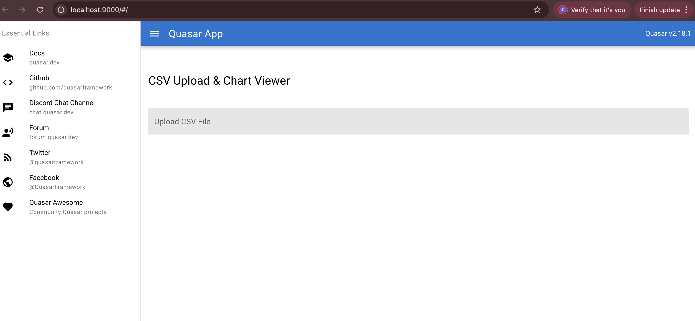
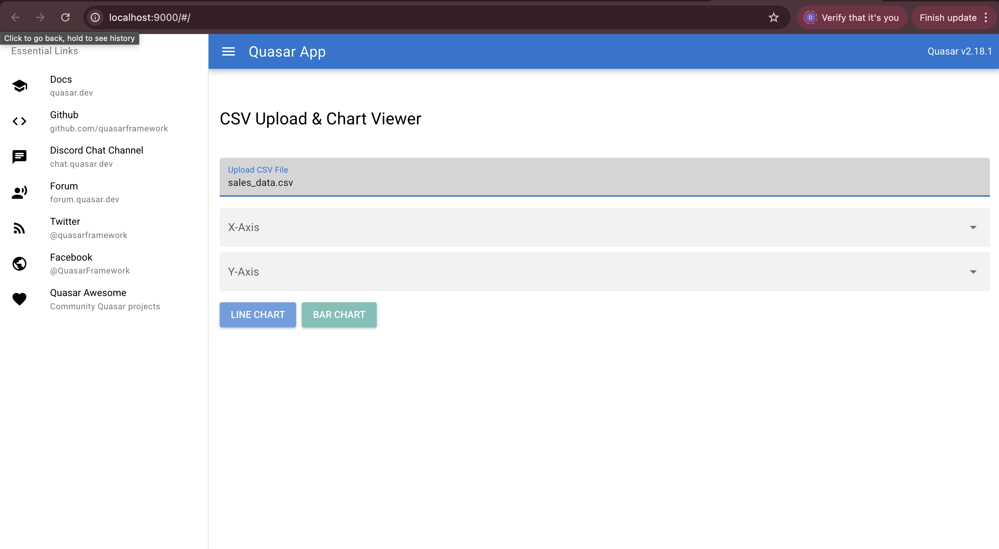
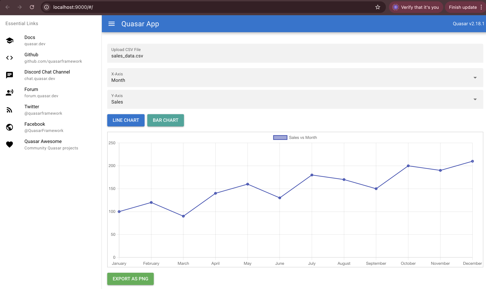
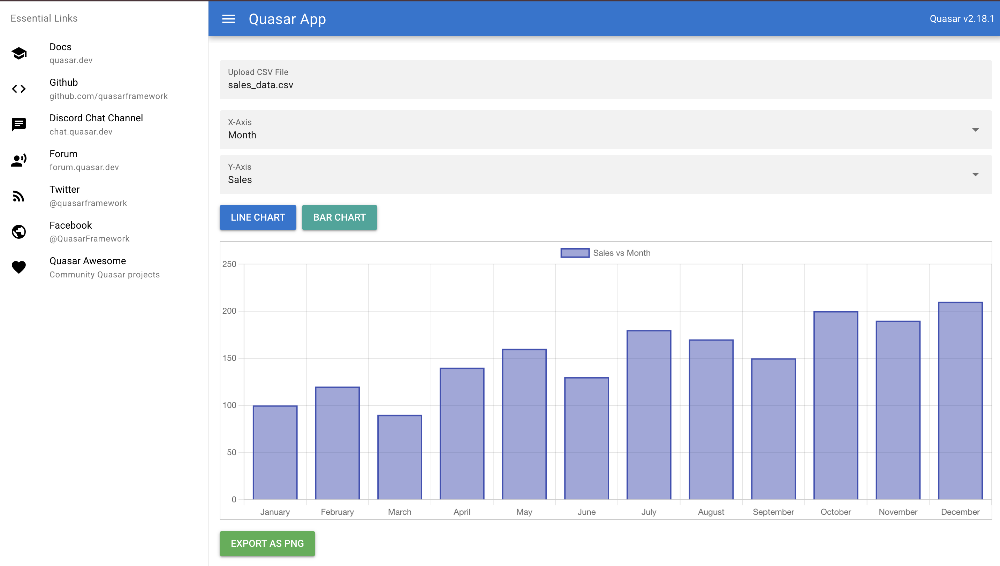

# Quasar Frontend Project


## Technologies & Quasar Features Used

- Vue 3
- Quasar CLI
- Quasar Components:
  - QLayout, QHeader, QToolbar
  - QPage
  - QCard
  - QBtn
- Material Icons

---

## Prerequisites

- Node.js (v16 or higher recommended)
- Quasar CLI installed globally:

```bash
npm install -g @quasar/cli
```

1. Clone the repository:

```bash
git clone https://github.com/your-username/quasar-project.git
cd quasar-project
```
2. Install Dependencies
```bash
npm install
```
3. Start the development server
```bash
quasar dev
```
Visit http://localhost:9000 to view.
## Screenshots





